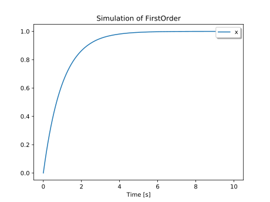
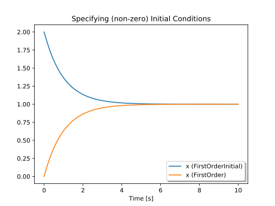
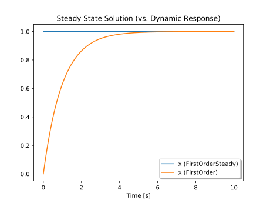
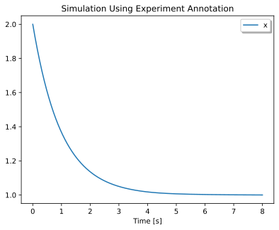

# Simple First Order System

Let us consider an extremely simple differential equation:

$$\dot{x} = (1-x)$$

Looking at this equation, we see there is only one variable, $x$. This
equation can be represented in Modelica as follows:

```modelica
model FirstOrder
  Real x;
equation
  der(x) = 1-x;
end FirstOrder;
```

This code starts with the keyword `model` which is used to indicate the start
of the model definition. The `model` keyword is followed by the model name,
`FirstOrder`. This, in turn, is followed by a declaration of all the variables
we are interested in.

Since the variable $x$ in our equation is clearly meant to be a continuous real
valued variable, its declaration in Modelica takes the form `Real x;`. The
`Real` type is just one of the types we can use.

Once all the variables have been declared, we can begin including the equations
that describe the behavior of our model. In this case, we can use the `der`
operator to represent the time derivative of `x`. Thus,

```text
der(x) = (1-x)
```

is equivalent to:

$$\dot{x} = (1-x)$$

Unlike most programming languages, we don't approach code like this as a
"program" to be executed one instruction after another. Instead, we use a
Modelica compiler to transform this model into something we can simulate,
producing a solution trajectory like this:



This gives you the first hint at one of the compelling aspects of using a
modeling language to describe mathematical behavior: we didn't need to describe
*how* to solve the differential equation. The focus is entirely on behavior.

## Adding Some Documentation {#first-order-doc}
Now that we've solved this simple equation, let's make the model a bit more
readable. Consider the following model:

```modelica
model FirstOrderDocumented "A simple first order differential equation"
  Real x "State variable";
equation
  der(x) = 1-x "Drives value of x toward 1.0";
end FirstOrderDocumented;
```

The quoted text blocks are **not** comments — they are "descriptive strings"
that can only appear in specific places to document the elements they are
attached to.

## Initialization {#first-order-init}
Modelica lets us describe initialization as well as behavior. As in the section
on [](#first-order-doc), we start from the same equation — but now, to make the
initial value of `x` be _2_, we add an `initial equation` section:

```modelica
model FirstOrderInitial "First order equation with initial value"
  Real x "State variable";
initial equation
  x = 2 "Used before simulation to compute initial values";
equation
  der(x) = 1-x "Drives value of x toward 1.0";
end FirstOrderInitial;
```

The resulting trajectory is quite different:



Mathematically this model is:

$$\dot{x} = (1-x);\; x(0) = 2$$

We can also constrain the *derivative* at the start. To require $\dot{x}(0)=0$:

```modelica
model FirstOrderSteady
  "First order equation with steady state initial condition"
  Real x "State variable";
initial equation
  der(x) = 0 "Initialize the system in steady state";
equation
  der(x) = 1-x "Drives value of x toward 1.0";
end FirstOrderSteady;
```

Simulating this system gives:



## Experimental Conditions {#experimental-conditions}
Compared with the very first result in [](#FO), which ran to a fixed stop time
we chose, a model can also carry its own experimental setup. A model developer
can associate experimental conditions with a model using an
`annotation`. The `experiment` annotation stores things like start time, stop
time, and tolerance — information about *how* to simulate, not about behavior:

```modelica
model FirstOrderExperiment "Defining experimental conditions"
  Real x "State variable";
initial equation
  x = 2 "Used before simulation to compute initial values";
equation
  der(x) = 1-x "Drives value of x toward 1.0";
  annotation(experiment(StartTime=0,StopTime=8));
end FirstOrderExperiment;
```

The following trajectory was simulated using these conditions:



The trajectory terminates at 8 seconds because the simulator used the
`experiment` annotation to determine how long to run the simulation.

::: {.note}
**Annotation Support**

The `experiment` annotation is widely supported. But in general, a tool is free
to ignore any or all annotations.
:::
